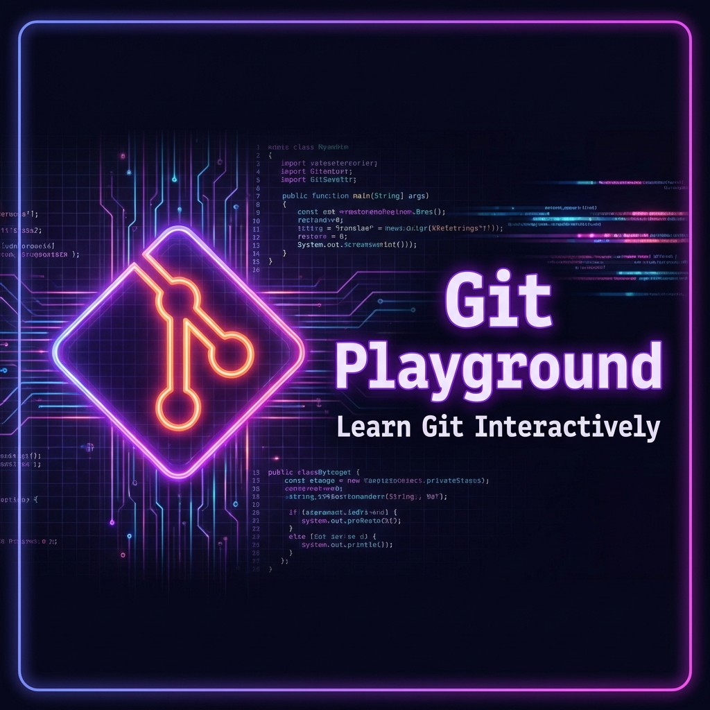

# Git Playground - 互動式 Git 學習實驗室

> **"這不只是一個指令練習工具，而是一場理解團隊協作的時空冒險。"**


## 🔗 線上體驗 (Demo)

👉 **[點擊這裡前往 Git Playground](https://git-playground-three.vercel.app/)**
*(支援手機、平板與桌機，隨時隨地都能練習)*

## 🎯 設計宗旨 (Mission)

市面上的 Git 教學多以單純的「指令練習」為主（例如：如何 add, commit, push）。然而，對於剛進入團隊的開發者來說，最困難的往往不是指令本身，而是 **「理解這些指令在團隊協作中的實際意義」**。

此專案的誕生，是為了讓使用者透過**可視化、互動式**的介面，親眼看見 Git 背後的資料流向。我不只是為了做一個練習工具而做，而是希望解決初學者在面對「合併衝突」、「分支管理」與「多人協作」時的恐懼與迷惘。

使用 RPG 與科幻的譬喻（如：平行宇宙、存檔點、時空融合），將抽象的技術概念轉化為直觀的遊戲體驗。

## ✨ 特色功能 (Features)

### 1. 🖥️ 沉浸式模擬終端機 (Immersive Terminal Simulation)
不再是枯燥的黑白畫面。打造了一個具有語法高亮、即時反饋的模擬終端機。在這裡，你可以安全地嘗試 `git add`, `git commit`, `git merge`, `git push` 等指令，而不必擔心弄壞真實的專案。

### 2. 🔮 即時狀態可視化 (Real-time State Visualization)
這不是靜態的圖片，而是會隨著你的指令即時變化的動態儀表板：
-   **組裝矩陣 (Working Directory)**：看見檔案如何被修改。
-   **融合核心 (Staging Area)**：看見檔案如何被暫存。
-   **星際地圖 (Repository)**：以時間軸呈現 Commit 歷史與分支 (HEAD) 指標。
-   **虛空傳送門 (Remote)**：模擬本地與遠端伺服器的同步狀態。

### 3. 🛡️ 團隊協作與 Git Flow (Collaboration Focus)
專案特別強調 **Branch (分支)** 與 **Merge (合併)** 的概念。透過「平行宇宙」的視覺化，讓使用者理解為什麼 Feature Branch 安全，以及 Main Branch 為何神聖不可侵犯。

### 4. 🎮 遊戲化學習體驗 (Gamification)
透過這套系統，學習 Git 不再是死背指令，而像是在操作一台精密的時空機器。每一次 Commit 都是一個存檔點，每一次 Checkout 都是一次時空跳躍。

## 🛠️ 技術堆疊 (Tech Stack)

本專案採用現代化的前端技術構建：

-   **前端開發:** React 19 + TypeScript
-   **建置工具:** Vite
-   **樣式系統:** Tailwind CSS v4 (最新版)
-   **動畫效果:** 
    -   GSAP (GreenSock) for 複雜的時間軸動畫與 ScrollTrigger
    -   CSS 3D Transforms (Tilt Effects)
-   **圖標系統:** Lucide React
-   **特效:** Canvas Confetti (慶祝特效)

## 🚀 如何開始 (Getting Started)

1.  **安裝依賴**
    ```bash
    npm install
    ```

2.  **啟動開發伺服器**
    ```bash
    npm run dev
    ```

3.  **開啟瀏覽器**
    前往終端機顯示的 Local URL (通常是 `http://localhost:5173`) 開始體驗。

---
